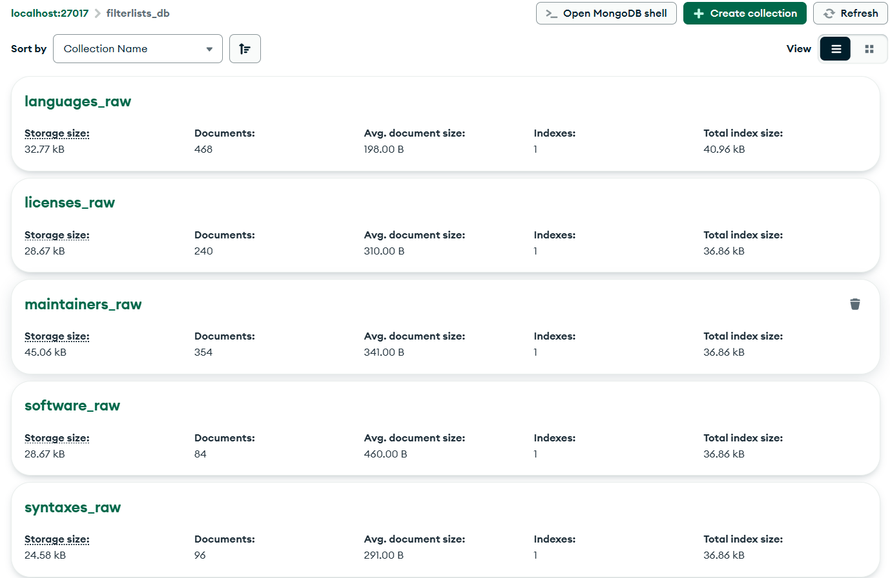

# FilterLists API — Custom Python ETL Data Connector

**Assignment 2:** Build custom Python ETL data connectors and submit to this repository.

---

## Author
**Name:** S Neha Shanmitha  
**Roll No:** 3122225001080 
**Branch/Section:** CSE B

---

## Overview
This project implements a modular ETL connector that extracts data from the public **FilterLists API** (`https://api.filterlists.com`), transforms records for MongoDB compatibility, and loads them into separate MongoDB collections (one collection per endpoint). The connector is designed to be safe (retries, timeouts), auditable (ingestion timestamps and audit log), and extensible.

---

## Contents of this folder
- `etl_connector.py` — main ETL script (Extract → Transform → Load)
- `requirements.txt` — Python dependencies
- `.gitignore` — ignore file (includes `.env`)
- `ENV_TEMPLATE` — sample environment file 
- `README.md` — this file
- `outputs/` — add screenshots showing script output, MongoDB data, and commit/PR pages

---

## API Information
**Base URL:** `https://api.filterlists.com`  
**Endpoints used:**
- `/languages`
- `/licenses`
- `/maintainers`
- `/software`
- `/syntaxes`
- `/tags`

Notes:
- The API is public and does not require authentication (no API key).
- For `/lists`, the connector optionally fetches `/lists/{id}` to get full details; this endpoint can be slow or heavy due to dataset size — the script includes timeouts and retries.

---

## Transformations applied
- Cleans empty/null fields (removes None, empty strings, empty lists/dicts).
- Adds ingestion metadata:
  - ingestion_time (timezone-aware)
  - fetched_at (ISO timestamp)
  - schema_version (1.0)
  - source object with api_base and endpoint
- Adds _source_id (API id if present) and record_index (position in fetched list).
- Endpoint-specific flattening:
  - /languages: name, iso_code
  - /licenses: license_name, license_url
  - /maintainers: maintainer_name, maintainer_url
  - /software: software_name, software_home
  - /syntaxes: syntax_name
  - /tags: tag_name
- Keeps the original JSON under data for auditability.

---

## MongoDB Collection Strategy
- One collection per endpoint, named <endpoint_without_slash>_raw. Example: /languages → languages_raw.
- Example of Document structure:
```
{
  "_source_id": 1,
  "record_index": 1,
  "endpoint": "languages",
  "ingestion_time": "2025-10-17T12:00:00+00:00",
  "schema_version": 1.0,
  "source": {
    "api_base": "https://api.filterlists.com",
    "endpoint": "/languages",
    "retrieved_at": "2025-10-17T12:00:00+00:00"
  },
  "name": "English",
  "iso_code": "en",
  "data": { /* original API object */ }
}
```
---
## Input JSON (/software):
```
{
    "id": 1,
    "name": "uBlock Origin",
    "description": null,
    "homeUrl": "https://github.com/gorhill/uBlock",
    "downloadUrl": "https://github.com/gorhill/uBlock#installation",
    "supportsAbpUrlScheme": true,
    "syntaxIds": [
            1,
            2,
            3,
            4,
            6,
            7,
            8,
            9,
            13,
            16,
            17,
            21,
            28,
            36,
            39,
            46,
            47,
            48,
            53,
            54
    ]
}
```
---
## Output JSON in MONGO after ETL (/software):
```
{
  "_id": {
    "$oid": "68f2313b828d2f5db0b0be8a"
  },
  "endpoint": "/software",
  "data": {
    "id": 1,
    "name": "uBlock Origin",
    "description": null,
    "homeUrl": "https://github.com/gorhill/uBlock",
    "downloadUrl": "https://github.com/gorhill/uBlock#installation",
    "supportsAbpUrlScheme": true,
    "syntaxIds": [
      1,
      2,
      3,
      4,
      6,
      7,
      8,
      9,
      13,
      16,
      17,
      21,
      28,
      36,
      39,
      46,
      47,
      48,
      53,
      54
    ]
  },
  "ingestion_time": {
    "$date": "2025-10-17T12:06:19.151Z"
  },
  "fetched_at": "2025-10-17T12:06:19.151715Z"
}
```

---
## Error handling & testing
The connector includes:
- HTTP timeouts (default REQUEST_TIMEOUT from .env, e.g. 10 seconds).
- Retries (3 attempts per request) with backoff.
- Graceful skipping on persistent failures (logs an error and continues).
- MongoDB connection check at startup.
---
## Example Output
Terminal Output:


---
Mongo update for all endpoints:


---
Mongo update for one endpoint (/languages):

